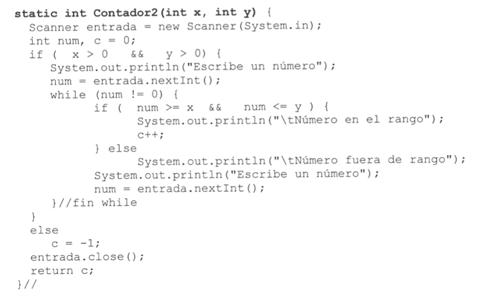
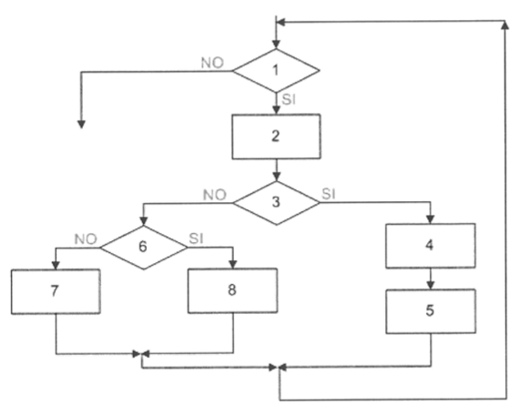
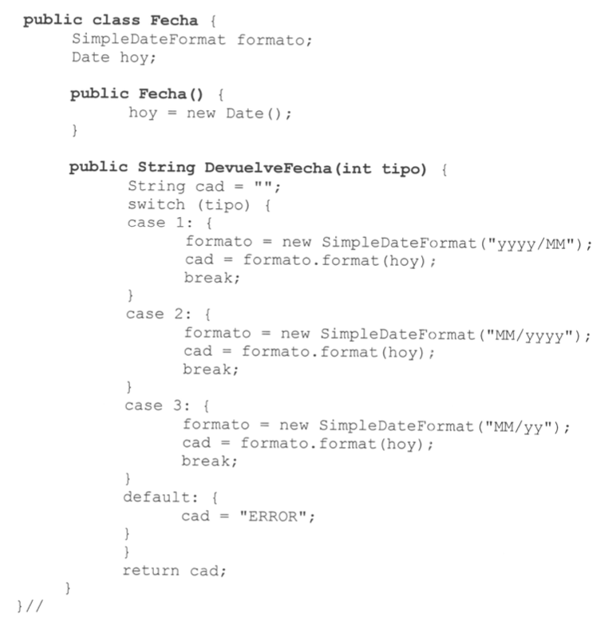

# EXAMEN FINAL UT 03

## EJERCICIO 1 : 4 PUNTOS
Realiza el grafo de flujo, calcula la complejidad ciclomática, define el conjunto básico de caminos y elabora los casos de prueba para cada camino  para la siguiente función Java:

## EJERCICIO 2 : 2 PUNTOS  (NO HACER SI TIENES MAS DE UNA UT A RECUPERAR)
Dado el siguiente diagrama de flujo 

Construye el grafo de flujo, indica el número de nodos, aristas, regiones, nodos predicado, la complejidad ciclomática y el conjunto de caminos independientes.

## EJERCICIO 3 : 4 PUNTOS
Desarrolla una batería de pruebas para probar el método DevuelveFecha() de la clase
Fecha que se expone a continuación. El método recibe un número entero y devuelve un
String con un formato de fecha que dependerá del valor de dicho número. Si el número
recibido es distinto de 1, 2 y 3 el método devuelve ERROR. La clase es la siguiente:

