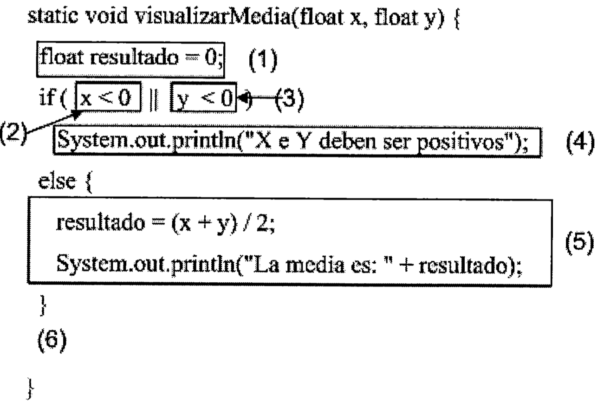
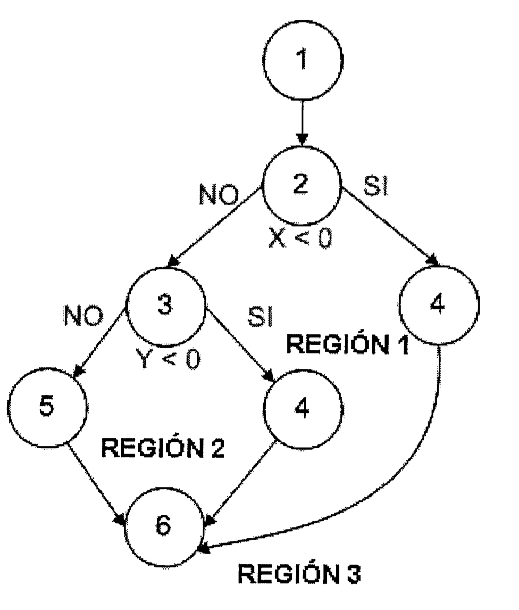
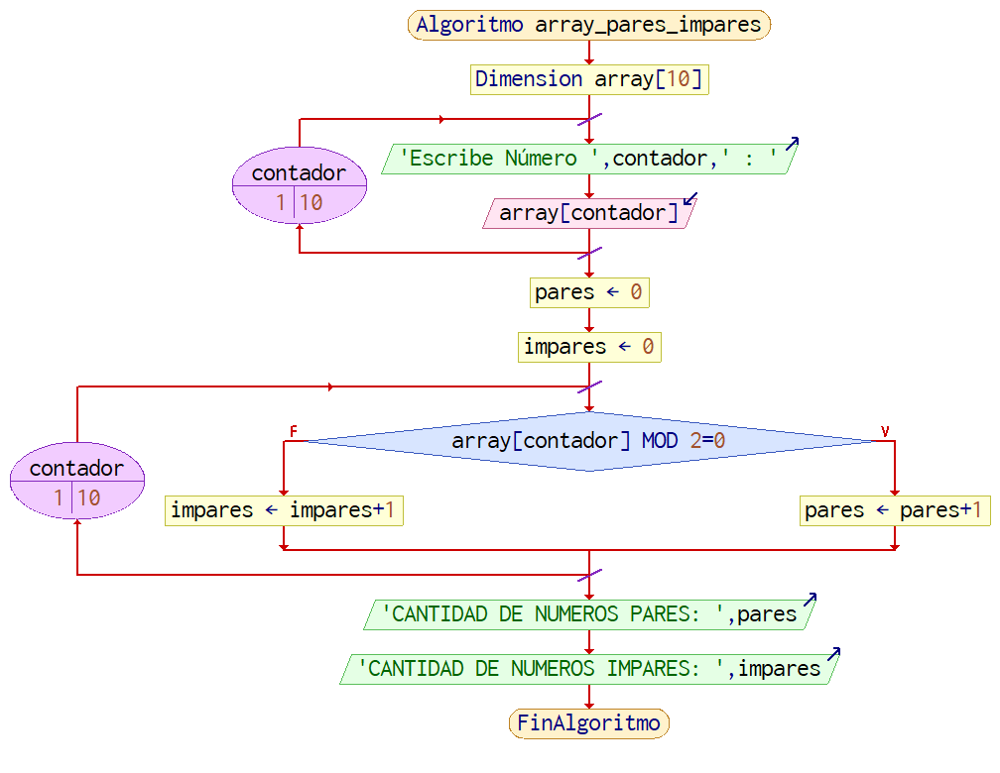
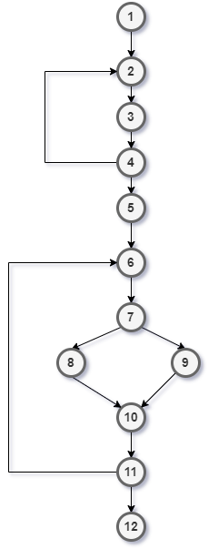
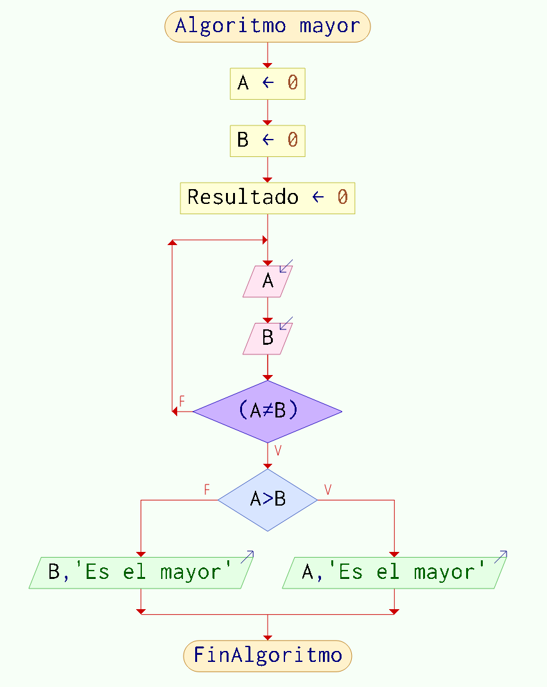
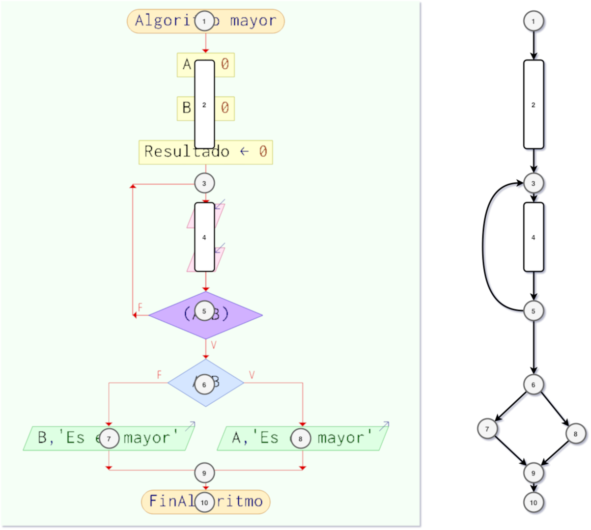

## EJEMPLO 1


En el siguiente ejemplo, se muestra el código de un programa que pide dos números y comprueba si son positivos, si no lo son, muestra por pantalla un mensaje de error. Si son positivos, calcula y muestra su media. 


### A) GRAFO ASOCIADO
A continuación se muestra el grafo asociado vinculando los nodos con cada bloque de código asociado del apartado anterior.


### COMPLEJIDAD CICLOMÁTICA

Aplicando la fórmula, podemos calcular la complejidad del grafo:

- V(G) = Nº de regiones = 3
- V(G) = Nº Nodos predicado + 1 = 2 + 1= 3 (Los nodos son el 2 y el 3)
- V(G) = (Aristas - nodos) + 2 = (8-7) + 2 = 1 + 2 = 3

### CAMINOS POSIBLES
Los caminos posibles son:

| CAMINO | NODOS RECORRIDOS |
|:------:|:----------------:|
|   A    |    1-2-3-5-6     |
|   B    |     1-2-4-6      |
|   C    |    1-2-3-4-6     |

### CASOS DE USO Y JUSTIFICACIÓN
La tabla de casos de prueba queda como sigue:

| **CAMINO** |  **CASO DE PRUEBA** |  **RESULTADO ESPERADO** |
|:--:|:--:|:--:|
| A| (x=4, y=10)| Mostrar “La media es 7”| 
| B| (x=-3 , y=10)| Mostrar “X e Y deben ser positivos”| 
| C| (x=-5 , y=-4)| Mostrar “X e Y deben ser positivos”| 

La selección de los valores se ha elegido en base a la siguiente justificación:

- El camino A debe cumplir la condición que X e Y sean positivos.
- El camino B debe cumplir la condición que X sea negativo e Y sea positivo.
- El camino C debe cumplir la condición que X e Y sean negativos.

## EJERCICIO 2

El siguiente algoritmo pide 10 número por teclado, los almacena en un array y acontinuación recorre dicho array cuenta la cantidad de primos por pantalla:

```code
Algoritmo array_pares_impares
    Dimension array[10]
    //Cargar Array - 10 Números 
    Para contador = 1 hasta 10 con paso 1 hacer
        Escribir "Escribe Número " , contador , " : "
        Leer array[contador]	
    FinPara
    //Mostrar Array
    pares = 0
    impares = 0
    Para contador = 1 hasta 10 con paso 1 hacer
        Si array[contador] Mod 2 = 0 Entonces		
            pares = pares + 1
        SiNo
            impares = impares + 1
        Fin Si
    FinPara
    Escribir "CANTIDAD DE NUMEROS PARES: " , pares
    Escribir "CANTIDAD DE NUMEROS IMPARES: " , impares
FinAlgoritmo
```

### A) GRAFO ASOCIADO

El diagrama de flujo obtenido es el siguiente:


Con el diagrama de flujo dibujado , creamos los nodos:


Y el grafo asociado es el siguiente:
(asumimos que el bucle "for" se va a ejecutar al menos una vez)

### COMPLEJIDAD CICLOMÁTICA

Aplicando la fórmula, podemos calcular la complejidad del grafo:

- V(G) = Nº de regiones = 4
- V(G) = Nº Nodos predicado + 1 = 3 + 1= 4 (Los nodos predicado son el 4, el 6 y el 7)
- V(G) = (Aristas - nodos) + 2 = (14-12) + 2 = 2 + 2 = 4

### CAMINOS POSIBLES
Los caminos posibles son:

| CAMINO | NODOS RECORRIDOS |
|:------:|:----------------:|
|   A    |    1-2-3-4-5-6-7-8-10-11-12     |
|   B    |    1-2-3-4-5-6-7-9-10-11-12      |
|   C    |    1-2-3-4-5-6-7-8-10-11-6-7-9-10-11-12     |
|   D    |    1-2-3-4-5-6-7-9-10-11-6-7-8-10-11-12     |

El camino C y D son análogos en cuanto al resultado final, por lo que se van a tratar con los mismos casos de uso
Descartamos las iteraciones del nodo "4" porque en realidad son repeticiones del mismo camino

### CASOS DE USO Y JUSTIFICACIÓN
La tabla de casos de prueba queda como sigue:

| **CAMINO** |  **CASO DE PRUEBA** |  **RESULTADO ESPERADO** |
|:--:|:--:|:--:|
| A| 1,3,5,7,9,11,13,15,17,19| Mostrar "NUMERO DE IMPARES: 10" "NUMERO DE PARES: 0"| 
| B| 2,4,6,8,10,12,14,16,18,20| Mostrar "NUMERO DE IMPARES: 0" "NUMERO DE PARES: 10"| 
| C| 1,2,3,4,5,6,7,8,9,10| Mostrar "NUMERO DE IMPARES: 5" "NUMERO DE PARES: 5"| 

La selección de los valores se ha elegido en base a la siguiente justificación:
- Para el camino A, solo guardamos números impares
- Para el camino B, solo guardamos números pares
- Para el camino C y D, guardamos números impares y pares


Realizar un algoritmo que permita leer dos valores distintos, y luego determinar cual de los dos valores es el mayor y escribirlo.

### A) GRAFO DE FLUJO

El organigrama sería el siguiente



Ahora creamos el grafo realcinando los bloques de código con los nodos:



### B) COMPLEJIDAD CICLOMÁTICA

Usando las fórmulas obtenemos:
- V(G) = nº de zonas = 3
- V(G) = aristas - nodos + 2 = 11 - 10 + 2 = 3
- V(G) = numero de nodos predicados (5-6)  + 1 = 4+1  = 5

### C) CAMINOS POSIBLES

| CAMINO | NODOS RECORRIDOS |
|:--:|:--:|
| A | 1-2-3-4-5-6-7-9-10 |
| B | 1-2-3-4-5-6-8-9-10 |
| C | 1-2-3-4-5-3-4-5-.... |
Aquí hay que tener en cuenta que el bucle inicial no es independiente del if de abajo, y por eso el hacer el bucle para pedir los números no influirá a la hora de elegir un camino de los de abajo.

### C) CASOS DE USO Y JUSTIFICACIÓN

| CAMINO | RANGO DE VALORES | VALOR ELEGIDO |
|:--:|:--:|:--:|
| A | B>A |  A=7 , B=9 |
| B | A>B |  A=6 , B=4 |
| C | A=B |  A=7 , B=7 |

Se podría pensar que hay cuatro caminos, pero el primero es una repetición, que es idenpendiente de los valores de abajo, por eso los caminos que salen de la repetición del bucle se pueden considerar como uno, puesto que ya los hemos recorrido anteriormente en los caminos A y B