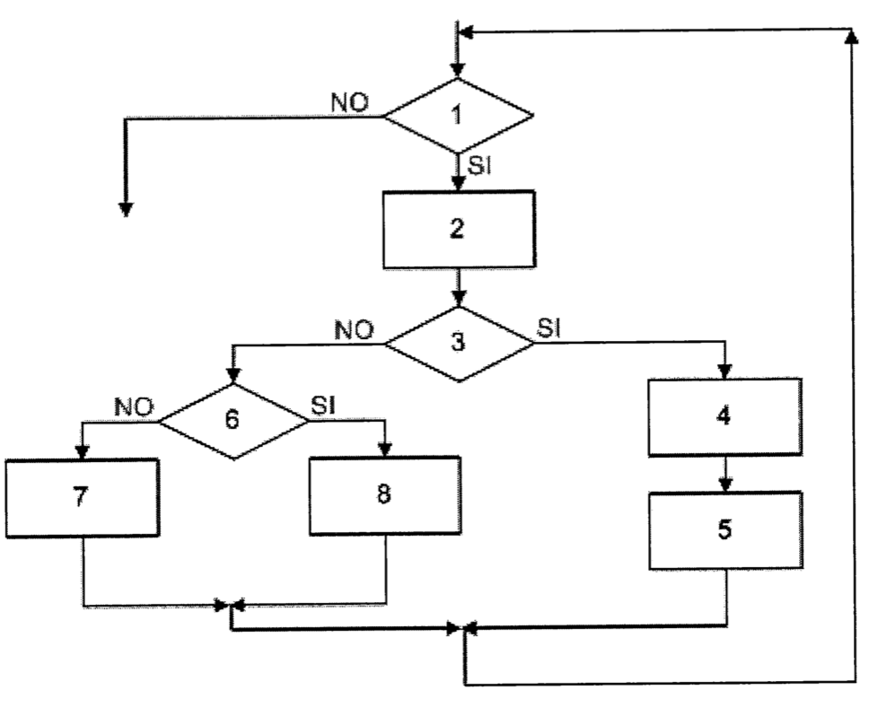
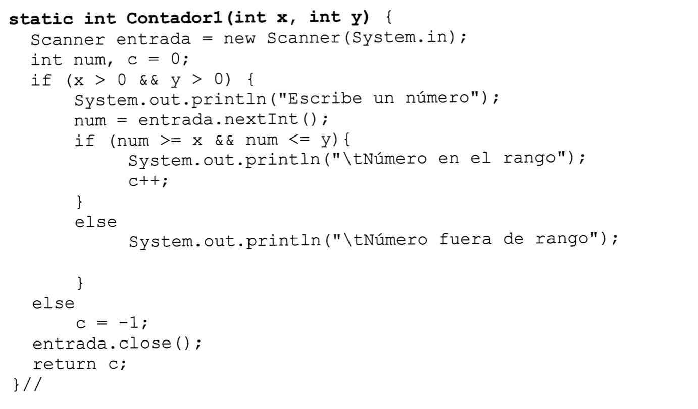

## EJERCICIO 1

Dado el siguiente código:

```code
Algoritmo sin_titulo
J = 2, S =0
Leer N
Mientras J<= N / 2 hacer 
  Si N / J =0
    S=S+1
	 J=J+1
  Fin_Si
Fin_Mientras
Si S = 0 Entonces
  Escribir N “es primo” 12. 
Sino
  Escribir N “no es primo” 14. 
Fin_Si
Fin
```

Se pide:
- Dibujar el grafo asociado.
- Calcular la complejidad del grafo asociado.
- Identificar los caminos posibles.
- Definir los casos de uso y justificar la selección de valores.


## EJERCICIO 2
DADO El SIGUENTE DIAGRAMA DE FLUJO:



Se pide calcular:

- Grafo de flujo asociado, indicando el número de nodos, aristas, regiones, nodos predicado.
- Complejidad ciclomática
- Conjunto de caminos independientes.
- Casos de prueba.

### EJERCICIO 3
Dado el siguiente código:



Se pide calcular:

- Grafo de flujo asociado, indicando el número de nodos, aristas, regiones, nodos predicado.
- Complejidad ciclomática.
- Conjunto de caminos independientes.
- Casos de prueba.
