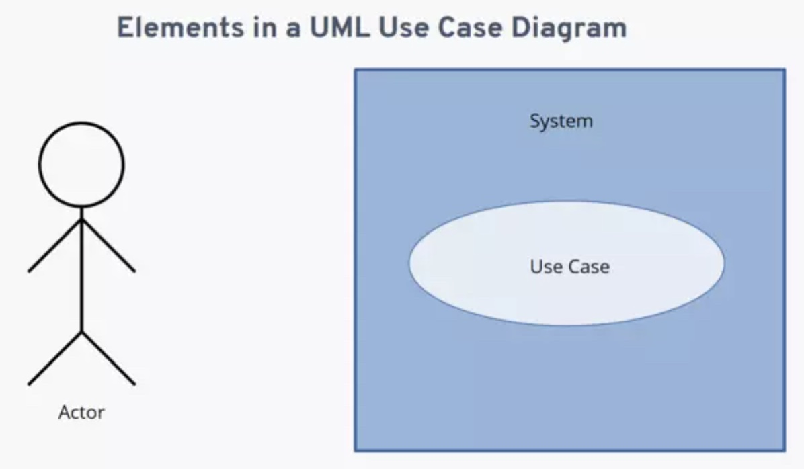
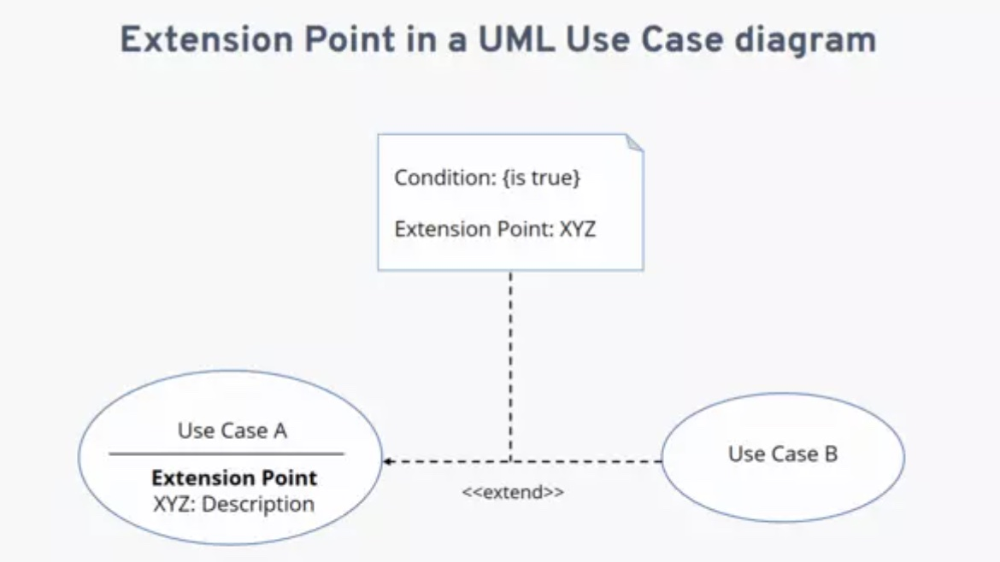

# DIAGRAMAS DE CASOS DE USO
 Los diagramas de casos de uso en UML se utilizan durante la fase de requisitos del desarrollo de software: suelen poner los requisitos del sistema en formato de diagrama, y es fácil ver de un vistazo qué acciones debe soportar un sistema. Por supuesto, habrá muchos casos de uso para su sistema y, por tanto, necesitará dibujar muchos diagramas de casos de uso.

Junto con otros diagramas UML, como los diagramas de actividades, secuencias y componentes, los diagramas de casos de uso ayudan a visualizar el software y los requisitos antes de empezar a programar.

En el diagrama de casos de uso, las funciones del sistema en cuestión se representan desde el punto de vista del usuario (llamado “actor” en UML). Este actor no tiene que ser necesariamente un usuario humano, sino que el rol también puede atribuirse a un sistema externo que accede a otro sistema. De este modo, el diagrama de casos de uso muestra la relación entre un actor y sus requisitos o expectativas del sistema, sin representar las acciones que tienen lugar o ponerlas en un orden lógico.

En la práctica, esta estructura es adecuada para representar claramente las funciones y/o objetivos más importantes de un sistema. Por esta razón, a la hora de desarrollar un software o planificar nuevos procesos empresariales, crear un diagrama de casos de uso suele ser uno de los primeros pasos, ya que permite visualizar clara y fácilmente qué casos de uso deben tenerse en cuenta durante el desarrollo para que los actores (y, en un sentido más amplio, también los operadores o clientes) logren su objetivo, en principio independientemente de la viabilidad técnica.

### Elementos y estructura del diagrama de casos de uso
Para garantizar que el diagrama de casos de uso sea comprensible para todo el mundo de un vistazo, se utilizan elementos estandarizados para elaborarlo. En primer lugar, hay tres elementos principales:

- **Actor**: tanto si es una persona, como un sistema, se representa con el dibujo de una figura humana esquemática.
- **Sistema**: el sistema al que se refiere el caso de uso tiene forma de rectángulo.
- **Caso de uso**: se muestra como una elipse que suele incluir un texto describiendo brevemente el proceso.

La relación entre estos elementos se representa con unas líneas de conexión llamadas asociaciones. Una línea recta entre el actor y el caso de uso evidencia que el actor y el caso de uso descrito en la elipse están relacionados. Una línea discontinua establece una relación entre diferentes casos de uso. Como hay dos tipos diferentes de asociación entre casos de uso, a las líneas se les añade una palabra clave, denominada “estereotipo” en UML, que se pone entre dos pares de paréntesis angulares. La relación de dependencia entre los casos de uso se representa con la punta de una flecha. Se distingue entre estos dos estereotipos:

- Asociación `<include>`: el caso de uso en el cual comienza la línea discontinua se relaciona con un segundo caso de uso señalado por la punta de la flecha.
- Asociación `<extend>`: el caso de uso en el cual comienza la línea discontinua puede extenderse al caso de uso señalado por la punta de la flecha bajo ciertas condiciones, que no han de cumplirse necesariamente en todos los casos.

En el ejemplo práctico que se ve a continuación -una aplicación de seguimiento de hábitos- hay dos actores externos, un usuario y un entrenador.

Si bien la asociación `<<include>>` requiere que ambos casos de uso se realicen, en el caso de la asociación `<<extend>>` esto depende de ciertas condiciones que se representan como el llamado punto de extensión en el diagrama de casos de uso en UML. En el esquema, el punto de extensión se representa con dos elementos:

Mención en la elipse del caso de uso: el posible punto de extensión se menciona y se describe brevemente bajo el título del caso de uso.

> Nota: partiendo del estereotipo <>, se dibuja una línea discontinua que finaliza en el gráfico de una nota (representada como un rectángulo con una esquina doblada). Esta nota incluye los títulos de “Condición” y “Punto de extensión”. Detrás del primero, figura entre corchetes la condición que debe cumplirse para que se ejecute el segundo caso de uso. Detrás de “Punto de extensión”, se indica el nombre que aparece en la elipse del caso de uso correspondiente, para dejar claro a qué se refiere la extensión.

## Pasos para crear un Diagrama de Casos de Uso

1. Identificar los actores involucrados: Determine qué entidades externas interactuarán con el sistema y considérelas como actores. Por ejemplo, usuarios, administradores, sistemas externos, etc.

2. Identificar los casos de uso principales: Identifique las funcionalidades principales del sistema y descríbalas como casos de uso individuales. Por ejemplo, "Iniciar sesión", "Crear nuevo usuario", "Realizar una reserva", etc.

3. Definir las relaciones de asociación: Conecte los actores y los casos de uso mediante relaciones de asociación. Esto indica qué actores están involucrados en cada caso de uso y cómo interactúan.

4. Identificar relaciones de inclusión y extensión: Si hay acciones comunes que se repiten en varios casos de uso, utilice relaciones de inclusión para indicar esa dependencia. Si hay casos de uso que agregan acciones opcionales a otros casos de uso, utilice relaciones de extensión para representar esa dependencia.

5. Detallar los casos de uso: Para cada caso de uso, agregue una descripción breve y clara de las acciones que se llevan a cabo dentro del caso de uso. Esto proporcionará una comprensión más profunda de las interacciones entre los actores y el sistema.

6. Refinar el diagrama: Revise y modifique el diagrama según sea necesario para garantizar que todas las interacciones y relaciones estén representadas de manera clara y concisa.

## EJERCIOS DE CASOS DE USO
Usa draw.io para generar los diagramas.

1. Sistema de Reservas de Hotel:
   - Actores: Cliente, Recepcionista
   - Casos de Uso: Realizar reserva, Cancelar reserva, Ver disponibilidad, Check-in, Check-out

2. Sistema de Ventas en Línea:
   - Actores: Cliente, Administrador, Proveedor
   - Casos de Uso: Realizar compra, Administrar inventario, Gestionar usuarios, Procesar pago, Generar informes

3. Aplicación de Redes Sociales:
   - Actores: Usuario, Amigo, Administrador
   - Casos de Uso: Crear cuenta, Publicar contenido, Agregar amigo, Buscar usuarios, Denunciar contenido inapropiado

4. Sistema de Biblioteca:
   - Actores: Bibliotecario, Usuario
   - Casos de Uso: Registrar préstamo, Devolver libro, Buscar libro, Renovar préstamo, Generar reporte de multas

5. Sistema de Control de Acceso:
   - Actores: Usuario, Administrador, Guardia de seguridad
   - Casos de Uso: Iniciar sesión, Administrar usuarios, Registrar acceso, Generar informe de accesos, Configurar permisos

### REFERENCIAS

- [https://drawio-app.com/blog/uml-use-case-diagrams-with-draw-io/](https://drawio-app.com/blog/uml-use-case-diagrams-with-draw-io/)
- [https://www.ionos.mx/digitalguide/paginas-web/desarrollo-web/diagrama-de-casos-de-uso/](https://www.ionos.mx/digitalguide/paginas-web/desarrollo-web/diagrama-de-casos-de-uso/)
- [https://www.javatpoint.com/uml-use-case-diagram](https://www.javatpoint.com/uml-use-case-diagram)
