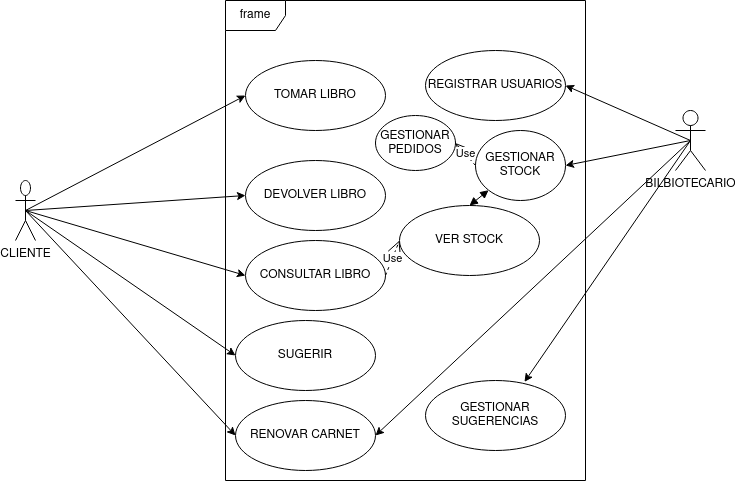

# EJERCICIOS RESUELTOS

Vamos a diseñar una aplicación web para la gestión de una biblioteca con los siguientes requisitos y funcionalidades:

- Los usuarios tienen que registrarse en la aplicación (y se almacenarán algunos datos sobre ellos)
- Los bibliotecarios también deben estar registrados para realizar su trabajo (con la información pertinente)
- Los usuarios podrán solicitar libros (son enviados a su domicilio) y devolverlos (la biblioteca envía un mensajero a su casa)
- Los usuarios podrán renovar el carnet (el bibliotecario confirmará más adelante dicha renovación desde la aplicación)
- Los usuarios pueden enviar sugerencias de libros que les gustaría que hubiera en el catálogo
- Los usuarios pueden enviar consultas sobre libros
- Los bibliotecarios podrán consultar los libros que un usuario tiene, además de consultar el stock de la biblioteca
- Los bibliotecarios también pueden responder a las consultas de los usuarios
- Los bibliotecarios pueden actualizar/renovar el stock de libros, para lo cual tendrán que hacer un pedido a través de la aplicación

### DIAGRAMA DE CASOS DE USO:

