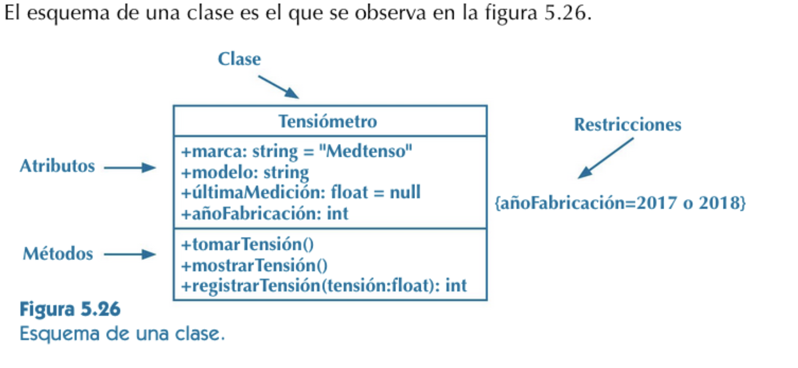
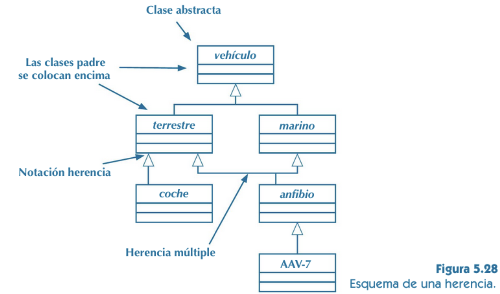
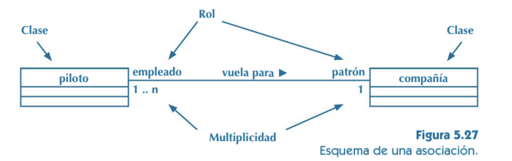
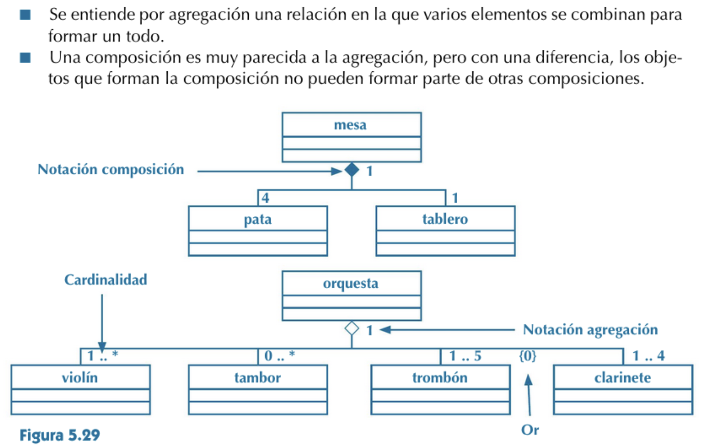

# UML

El Lenguaje Unificado de Modelado o notación UML es probablemente la representación visual de programas más conocida y utilizada habitualmente en el desarrollo de software. Existe una amplia gama de diagramas que le ayudarán a especificar sus datos y procesos antes de empezar a programar. Le ayudan a aclarar requisitos y limitaciones, aceleran la implementación, proporcionan una guía para realizar pruebas exhaustivas y evitan que se cuelen errores a lo largo de todo el proceso de desarrollo de software.

Nos vamos a centrar en una categoría de diagramas UML: los diagramas estructurales. Probablemente los diagramas estructurales más conocidos son los diagramas de clases, que especifican las estructuras de datos y sus relaciones dentro de tu programa.

Los diagramas de clase no sólo se utilizan para programar. Por ejemplo, los analistas de negocio pueden modelar la estructura empresarial de los activos y los procesos asociados a ellos.

## Notación del diagrama de clases UML
Como es lógico, las clases de su programa van en un diagrama de clases, incluyendo sus atributos (variables) y métodos (funciones). Estos diagramas constituyen la base de la programación orientada a objetos.

## Clases
Cada clase se representa mediante una caja con tres secciones apiladas una sobre otra con el siguiente formato. Sólo el nombre de la clase es obligatorio

Nombre de la clase
Atributos - nombre: tipo
Operaciones - nombre del método (lista de parámetros): tipo del valor de retorno

El símbolo delante del nombre del atributo o método indica su visibilidad - public (+), protected (#), private (-), derived (/) o package (~).

Al dibujar un elemento de clase en un diagrama de clases, debe utilizar el compartimento superior, y los dos compartimentos inferiores son opcionales. (Los dos inferiores serían innecesarios en un diagrama que represente un mayor nivel de detalle en el que el propósito sea mostrar sólo la relación entre los clasificadores).

## Herencia
Cuando una clase hija tiene las mismas operaciones y atributos que su clase padre, pero añade algunos extras propios, eso es herencia. La herencia es una característica esencial de la programación orientada a objetos. Puedes indicarlo en tu diagrama dibujando una flecha sin relleno desde la clase hija a la clase padre.

Consejo: Las clases abstractas pueden indicarse poniendo en cursiva el nombre de la clase.

## Asociaciones
Cuando existe un vínculo entre clases puedes indicarlo de varias maneras.

- **Bidireccional**: Ambas clases conocen la asociación - dibuja una línea continua entre las clases, sin flechas.
- **Unidireccional**: Sólo una clase conoce a la otra - utilice una punta de flecha abierta. Por ejemplo: FailedStudentsList conocerá la clase Student, pero la clase Student no conoce la clase FailedStudentsList.
- **Dependencia**: Cuando los cambios en una clase causan cambios en otra clase, son dependientes. Utilice una línea discontinua para mostrar la dependencia.
- **Agregación**: Cuando una clase contiene varias instancias de otra clase, pero esas instancias siguen existiendo aunque se elimine la clase contenedora, eso es agregación. Utilice un rombo hueco para indicar la clase contenedora.
- **Composición**: Es similar a la agregación, pero cuando se elimina la clase contenedora, también se eliminan las instancias de las otras clases. La clase contenedora está "compuesta" por instancias de las otras clases. Utilice un rombo sólido para indicar la clase contenedora.
- **Multiplicidad**: Donde se indica cuántas instancias de cada clase están relacionadas con la otra clase. Puede ser cero o más (0..*), uno a uno (1..1), o 1 a un número específico (1..5).
Existen muchas otras formas de indicar asociaciones, como las clases de asociación, las asociaciones reflexivas, los paquetes, etc.

### FUENTES:
https://drawio-app.com/blog/uml-class-diagrams-in-draw-io/

https://developer.ibm.com/articles/the-class-diagram/

## EJERCICIOS

### FACTURACION 
Se desea realizar el análisis de un sistema de gestión informática de un pequeño almacén dedicado a vender artículos a clientes. Para ello se dispone de una base de datos donde están almacenados los datos de los clientes, de los artículos, de las facturas y los datos de los detalles de las facturas. 

- Los datos de clientes son: código de cliente, nombre, teléfono y dirección. Datos de artículos son: código del artículo, denominación, pvp y stock del almacén. 
- Los datos de facturas son: número de factura y la fecha factura.
- Hay que tener en cuenta que un cliente tiene muchas facturas. 
- Cada factura está formada por varias líneas de factura o detalles que se identifican por el código de línea. Una factura tendrá varias líneas de factura.
- En cada línea de factura se indica también el código de artículo y las unidades vendidas. Un artículo podrá estar en muchas líneas de factura.

### MATRICULAS
En el instituto, se quiere informatizar el procesor de matricula:
- Cuando un alumno venga a matricularse debe rellenar una ficha con sus datos: DNI, número de expediente, nombre, apellidos, domicilio, teléfono y e-mail
- El centro  almacena la información sobre todos los cursos que se imparten en el centro: un código, el nombre, aula donde se imparte y el horario.
- También se guarda información sobre todas las asignaturas de todos los cursos con el fin de conocer en que asignaturas se matricula cada alumno. De cada una guardaremos el nombre, el profesor que la imparte y el número de horas a la semana. 
- Hay que tener en cuenta que todos los alumnos se matricularán al menos de una asignatura en algún curso
- Los profesores también están dentro de la Base de Datos, con la siguiente información: nombre, apellidos, domicilio y e-mail. 
- Un profesor podrá impartir como máximo 6 asignaturas y deberá impartir al menos una. También habrá que almacenar el curso del que un profesor es tutor, teniendo en cuenta que puede que no sea tutor de ningún curso.
Hay que tener en cuenta que es importante almacenar las notas que cada alumno tiene en cada asignatura a lo largo del curso en las distintas evaluaciones, así como las observaciones que los profesores podrán anotar. 

